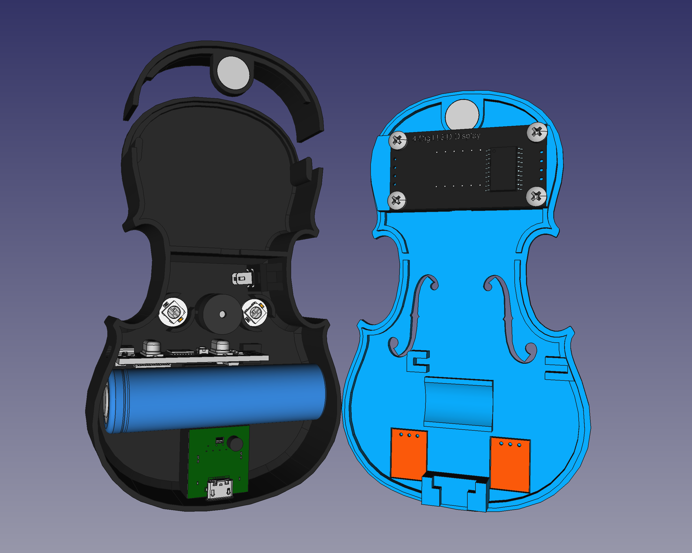
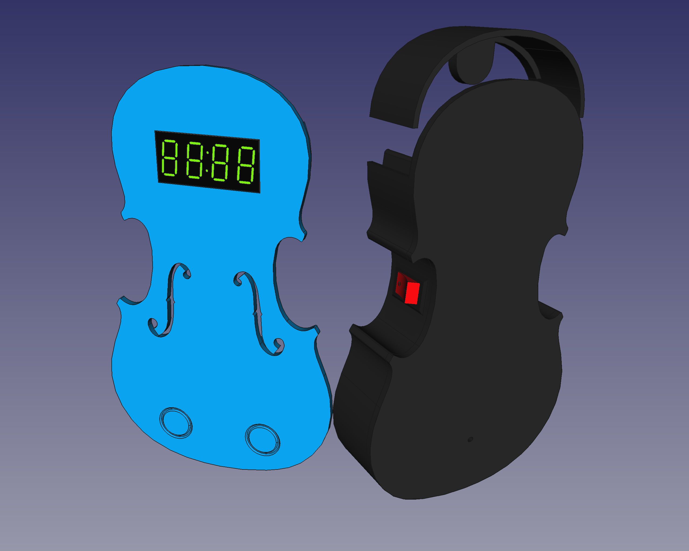

# mana16
Un regalo único y especial, para alguien único y especial 😊, y que tiene de todo:

* Metrónomo (visual y sonoro)
* Estuche (un compartimento secreto)
* powerBank (para una emergencia)
* Programable y hackeable! (modifícalo para que sea lo que tú quieras: un crono, una alarma, un juego...)

Y por supuesto, **OpenSource y CC** (compartir es amar!).

 

## LICENCIA / LICENSE

Este trabajo esta sujeto a la licencia [GNU General Public v3.0 License](LICENSE-GPLV30). Todos los ficheros multimedia y de datos que no sean código fuente están sujetos a la licencia [Creative Commons Attribution 4.0 BY-SA license](LICENSE-CCBYSA40).

Más información acerca de estas licencias en [licencias Opensource](https://opensource.org/licenses/) y [licencias Creative Commons](https://creativecommons.org/licenses/).

This work is licensed under the [GNU General Public License v3.0](LICENSE-GPLV30). All media and data files that are not source code are licensed under the [Creative Commons Attribution 4.0 BY-SA license](LICENSE-CCBYSA40).

More information about licenses in [Opensource licenses](https://opensource.org/licenses/) and [Creative Commons licenses](https://creativecommons.org/licenses/).
